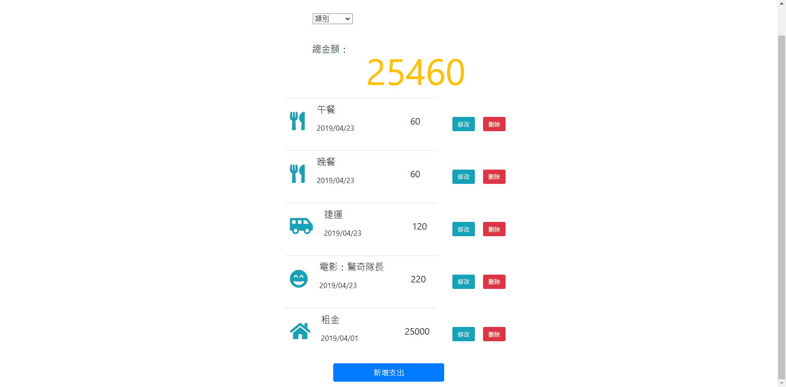
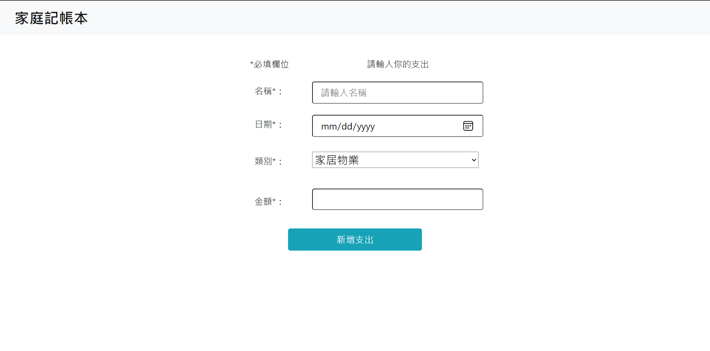
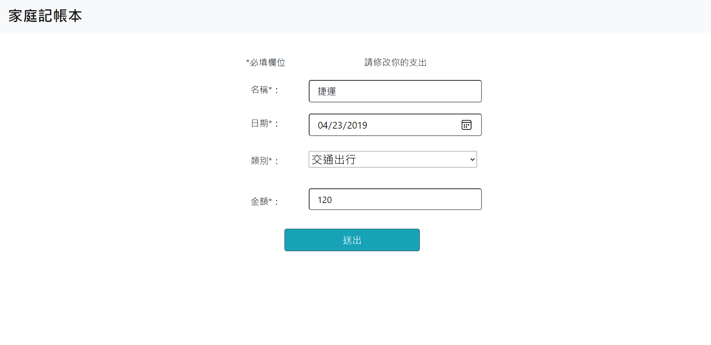

# 專案簡介
使用models/seeds資料夾內的categorySeeder.js以及recordSeeder.js作為seed data，設置連接MongoDB資料庫以支援CRUD操作，運用MongoDB內的資料做成一個透過Node.js及Express運作的記帳網頁。

## 功能
1. 首頁上方有category filter讓使用者篩選特定類別的帳目，總金額會隨著篩選類別作對應改變。

2. 使用可者以在首頁看到所有帳目的資料(由上往下顯示最新至最舊) ：
  - 類別圖案
  - 帳目名稱
  - 帳目日期
  - 帳目金額

3. 使用者可以一次新增一筆支出帳目

4. 使用者可以編輯一筆帳目

5. 使用者可以刪除一筆帳目

</img>
</img>
</img>

## 安裝
1. 開啟終端機(Terminal)cd 到存放專案的本機位置並執行:
```
git clone https://github.com/Armogo/expense-tracker.git
```

2. 初始設定

```
cd expense-tracker-main  //切至專案資料夾

npm install  //安裝套件
```

3. 安裝MongoDB Community Server 4.2.X 版本 https://www.mongodb.com/try/download/community

4. 確認 MongoDB 伺服器已啟動

5. 下載 Roto 3T(搭配 MongoDB 的圖形介面。) https://robomongo.org/

6. 開啟Roto 3T ->Connect to localhost -> Create Database -> Database Name: **expense-tracker**

## 執行程式

1. 產生種子資料
```
npm run seed // 執行categorySeeder.js及recordSeeder.js 產生seed data並儲存於MongoDB
```
終端機顯示"`record seed data successfully created!`以及`category seed data successfully created!`"即成功將seed data儲存於MongoDB的expense-tracker資料庫。

2. 開啟程式

```
npm run dev  //執行程式
```
終端機顯示"`App is listening on localhost:3000`"及"`mongodb connected!`"即成功啟動，請至 http://localhost:3000 體驗程式。

3. 終止執行

在終端機畫面按2次 `Ctrl+C` 終止server運作。

## 使用工具
- Visual Studio Code - 開發環境
- Express 4.17.1 - 應用程式架構
- Express-Handlebars 5.3.2 - 模板引擎
- Express-body-parser - read HTTP POST data
- Express router - 根據Separation of Concerns(關注點分離)原則，將route設定從app.js抽出，獨立放入routes資料夾管理
- nodemon 2.0.12 - 實時偵測檔案更動部分且自動重新執行應用程式
- MongoDB - data base
- Roto 3T - 搭配 MongoDB 的圖形介面
- mongoose 5.13.3 - 操作MongoDB資料庫
- method-override 3.0.0 - 使HTTP request動詞可更改為RESTful風格，路由語義化
- moment: 2.29.1 - 將Date資料轉換成指定格式